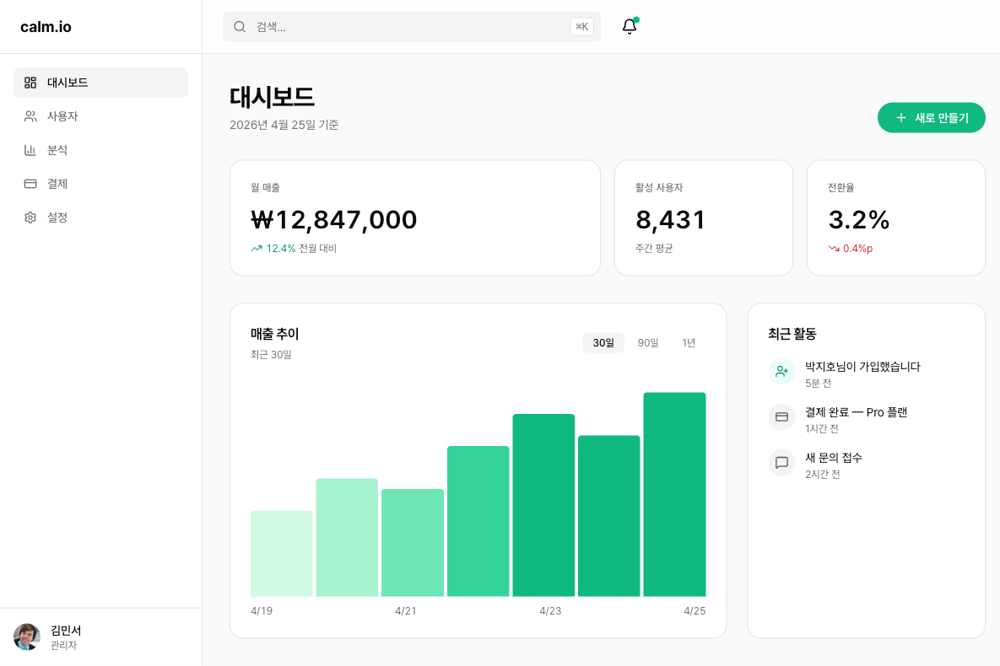
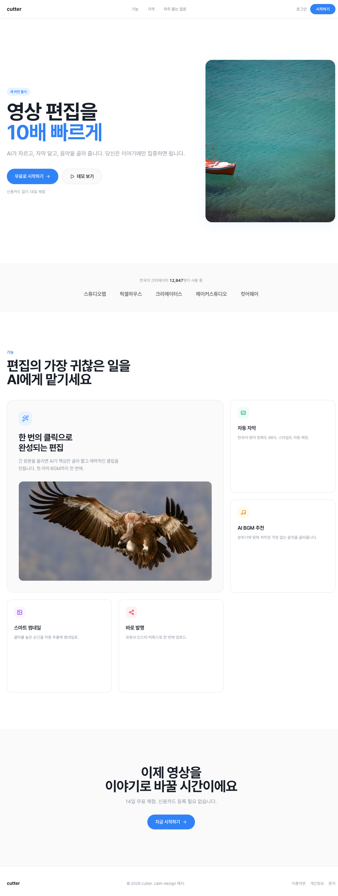
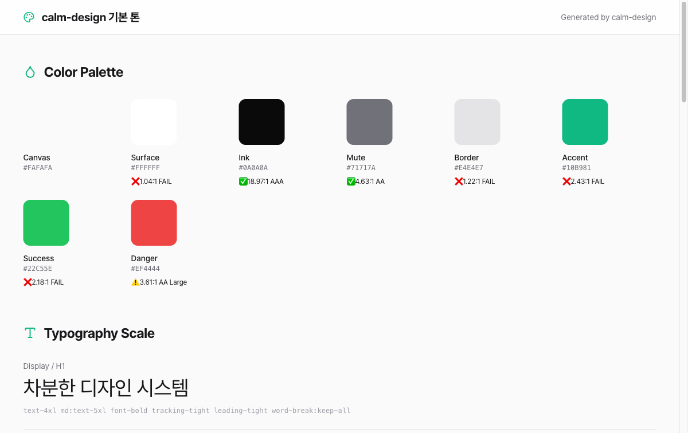

# calm-design

> **Premium designs that don't look AI-generated** — A Claude skill for refined, polished web design.

[한국어](./README.md)

---

## Why calm-design?

Ever generated a web design with AI? You can instantly tell it's AI-made.

**The usual AI design tells:**
- Purple/blue gradient backgrounds
- Three identical cards in a row
- "Elevate Your Experience" clichés
- Pure black (#000000)
- Inter font everywhere

calm-design **automatically detects and blocks these patterns**. Instead, it creates designs that look like Stripe, Linear, or Vercel — **refined and intentional**.

---

## What makes it different?

### 1. 50+ "AI smell" patterns blocked automatically

| Won't happen | Instead |
|---|---|
| Purple/blue gradients | Calm, muted backgrounds |
| 3 equal cards in a row | Asymmetric bento grids |
| Inter, Roboto fonts | **Geist, Cabinet Grotesk** (or Pretendard for Korean) |
| Pure black #000000 | Soft charcoal #0A0A0A |
| "Elevate", "Seamless" | Natural, specific copy |

### 2. Self-critique loop

Other AI tools just output and walk away. calm-design:
1. Generates the design
2. **Visually inspects** its own output (Vision AI)
3. **Auto-fixes** any violations

### 3. Reference library of 33 brands

Request "Linear style" or "Stripe-like" and it references actual design systems:

**Global (18):** Linear · Vercel · Stripe · Notion · Figma · Supabase · Raycast · Framer · Apple · Airbnb · Spotify · Tesla · BMW · Cursor · Superhuman · Cal.com · Mintlify · Replicate

**Korean (15):** Toss · Karrot · Baemin · Kakao · Naver · Coupang · Kurly · Musinsa · Ohou · Class101 · Yanolja · Zigbang · 29CM · Line · Starbucks Korea

---

## Just say what you want

```
"Make me a landing page. Clean, Linear-style."
```

```
"Design a dashboard. Lots of data to show."
```

```
"Polish this code. Make it look less AI-generated."
```

```
"Show me 3 different style options."
```

Your wording changes the output:
- **"minimal"** → More whitespace, cleaner
- **"trendy"** → Current design trends
- **"data-heavy"** → High information density
- **"calm"** → Less motion, more static

---

## See examples

### Example 1: SaaS Dashboard



**Request:** "B2B SaaS dashboard. Calm, data-dense."

**Result:**
- Sidebar + command search (⌘K)
- Asymmetric KPI cards (2-1-1 layout)
- Charts and activity feed
- Emerald accent color

→ [View code](./examples/01-saas-dashboard-ko/)

### Example 2: Landing Page (Toss-inspired)



**Request:** "AI video editing SaaS landing. Toss-style."

**Result:**
- Hero → Social proof → Bento features → CTA
- Single blue accent
- Generous whitespace

→ [View code](./examples/02-landing-toss-style/)

### Example 3: Design System Catalog



**Request:** "Document this design's colors, fonts, and components."

**Result:** Visual design system documentation (HTML)

→ [View code](./examples/04-preview-catalog/)

### Example 4: React Dashboard (shadcn + zustand)

**Request:** "Build a dashboard in React. Production code."

**Result:** Next.js 14 + shadcn/ui + zustand + Framer Motion integration
- shadcn Button (with loading state)
- zustand for sidebar state management
- Framer Motion entry animations
- lucide-react icons

→ [View code](./examples/05-react-dashboard/)

```bash
# How to run
cd examples/05-react-dashboard
npm install
npm run dev
```

---

## Installation

### Option 1: Use in all projects (global install)

Run these commands in your terminal:

```bash
# 1. Download the repository
git clone https://github.com/calmtiger86/calm-design.git

# 2. Copy to skills folder
cp -r calm-design ~/.claude/skills/calm-design
```

Restart Claude Code and the skill will be available in all projects.

### Option 2: Use in a specific project only

Run these commands in your project folder:

```bash
# 1. Download the repository
git clone https://github.com/calmtiger86/calm-design.git

# 2. Copy to project's skills folder
mkdir -p .claude/skills
cp -r calm-design .claude/skills/calm-design
```

### Verify installation

Ask Claude to confirm:

```
"Do you have the calm-design skill?"
```

Or just try it:

```
"Make me a landing page"
```

---

## FAQ

**Q: Do I need to know how to code?**

No! Just describe what you want in natural language. Code is generated automatically and you can open it directly in your browser.

**Q: Can I modify the generated design?**

Absolutely. Just say "change this color" or "make the button bigger" and it will update.

**Q: Does it work for non-English designs?**

Yes. It's Korean-first by default (Pretendard font, Korean typography rules), but switches to English mode with appropriate fonts (Geist, etc.) when requested.

**Q: Can I use it commercially?**

Yes, MIT license. Use it freely.

---

## License

MIT — Free for commercial use, modification, and redistribution.

---

**Made with ☕ by [@calmtiger_](https://threads.net/@calmtiger_)**
